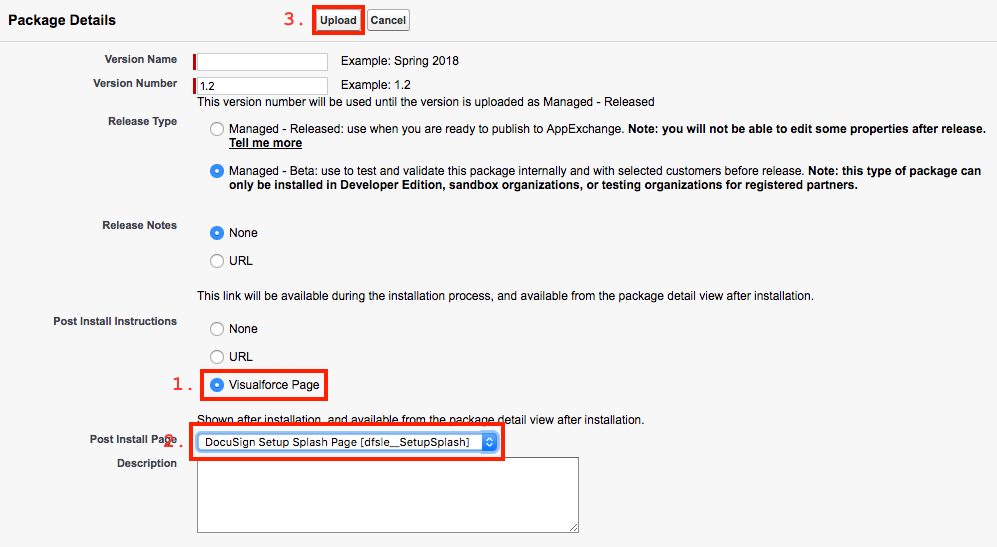

# DocuSign for Salesforce Essentials

This is the new DocuSign for Salesforce base package. This is a lighter version of DFS that is installable on Salesforce Essentials organizations. This package also contains the Apex Toolkit.

[API Documentation and Code Examples](https://developers.docusign.com/salesforce/)

## Development Notes
Salesforce DX is used to build, test, and deploy this project.
1. [Install and configure Salesforce DX](./doc/sfdx.md).
1. Create a scratch org for development: `sfdx force:org:create -f ./etc/dev.json -s -a dfsle-scratch-org`. This org will persist for 7 days by default. Customize its alias by changing `dfsle-scratch-org` to the desired value.
1. Push the source to your scratch org: `sfdx force:source:push`.
1. Assign the "DocuSign Administrator" permission set: `sfdx force:user:permset:assign -n DocuSign_Administrator -u dfsle-scratch-org`.

Once you have completed the initial scratch org setup, you can sync any local changes with that org using the `sfdx force:source:push`.

## Testing Notes
- Run unit tests with coverage: `sfdx force:apex:test:run -c -r human -w 5`. This will wait 5 minutes for the test run to complete. You can also execute this command asynchronously by omitting `-w #`.
- Default test scratch orgs should use the configuration located at `etc/test.json`.

## Packaging Notes
Until Salesforce 2nd Generation packages (2GP) is GA, we will continue manually uploading new package versions on our packaging org.
1. Connect the packaging org: `sfdx force:auth:web:login -a dfsle-packaging-org`. This is a one-time step. You can use whatever alias you desire.
1. Deploy the code: `sfdx force:source:deploy -u dfsle-packaging-org -p ./pkg -w 15`. This will wait 15 minutes for the deployment to complete. You can also execute this command asynchronously by omitting `-w #`.

When uploading the managed package, you must set the post-install splash page. From the upload screen:

1. Under "Post Install Instructions", select "Visualforce Page".
1. Under "Post Install Page", select "DocuSign Setup Splash Page [dfsle__SetupSplash]"
1. Click "Upload".

