# Authentication with the Apex Toolkit

In the latest releases (v2+) of the Apex Toolkit, we have refactored admin and end-user logins to leverage [DocuSign OAuth](https://www.docusign.com/blog/dsdev-dev-w-ds-oauth-intro/) and [DocuSign Org Admin](https://www.docusign.com/products/org-admin). We made this change to improve the security and administrative controls over the login process. While this change is very beneficial overall to our developers and administrators, it entails additional overhead for integrations.

After installing or upgrading Apex Toolkit v2+, you must authenticate with DocuSign. This step is required for new installs or upgrades from v1.x.

All of the following steps are described in more detail in the [DocuSign Apps Launcher Admin Guide](https://support.docusign.com/en/guides/docusign-apps-launcher-for-salesforce-admin-guide).

## Connect Salesforce to your DocuSign account
1. Open Salesforce application menu using the icon in the upper left corner.
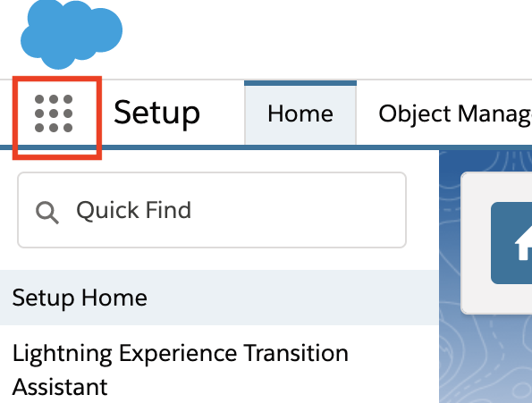

1. Click DocuSign Apps Launcher.
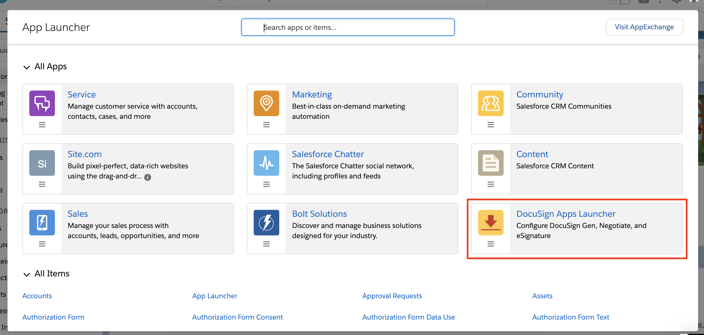

1. To log into your DocuSign developer sandbox, expand Advanced Options and click Log in to Demo Account. You may have to enable pop-up windows in your browser.
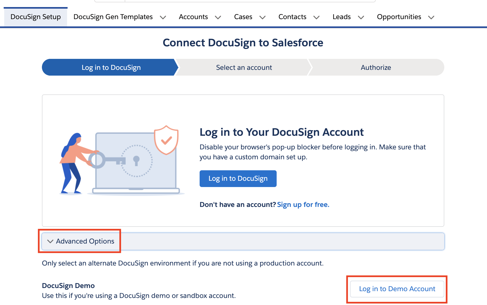

1. Enter your DocuSign credentials.
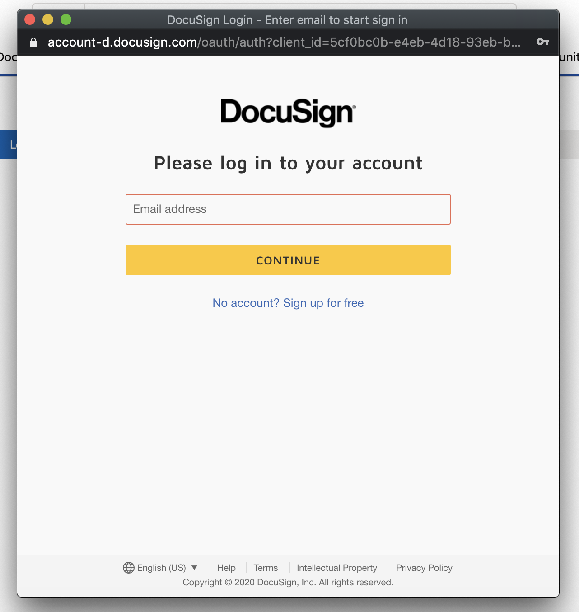

1. Click Accept when prompted for consent. You may have to authenticate with Salesforce again after this step.
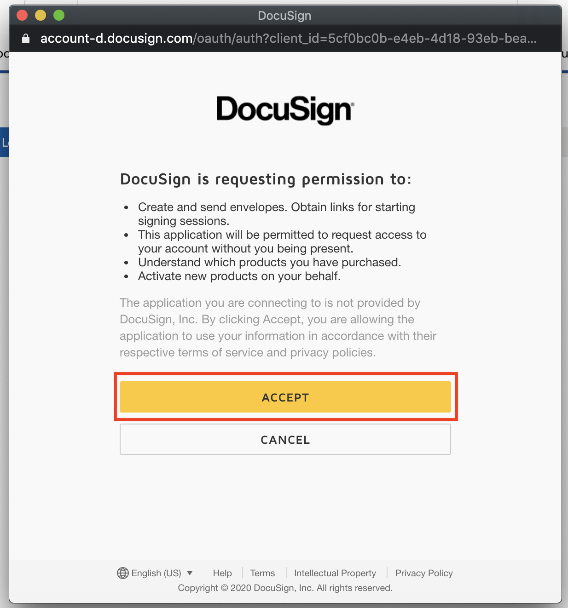

1. Choose your DocuSign account and click Select.
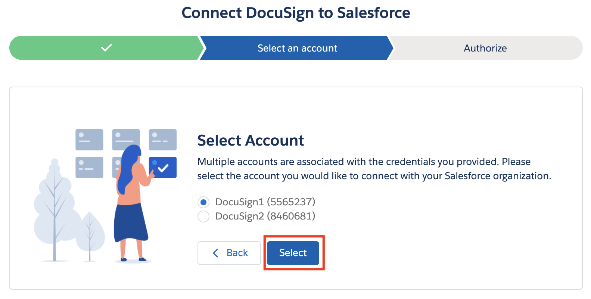

1. You may have to authorize DocuSign to communicate with Salesforce. Start this process by clicking Allow Access and follow the prompts.
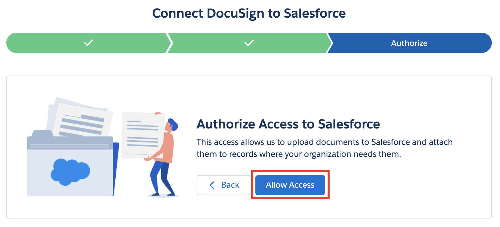

## Add Salesforce users to your DocuSign account
Once the setup admin authentication is complete, you can add additional users to your DocuSign account.

1. Open DocuSign Apps Launcher from the Salesforce app menu.

1. Navigate to the DocuSign Setup tab and click User Management, then Add Users.
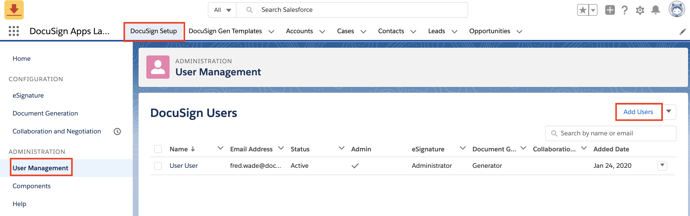

1. Search for the users you want to add and click the checkbox next to their names. Click Add Users once complete.
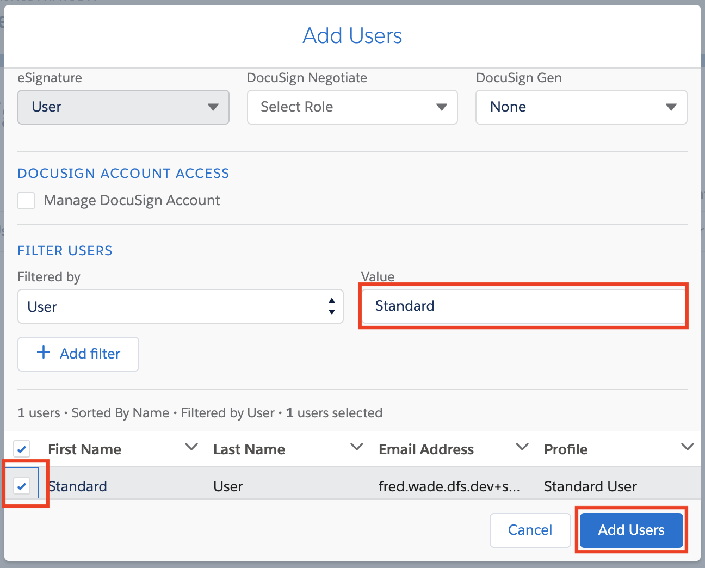

The newly-added users begin in the Pending state. They will switch to Active once they have granted consent.
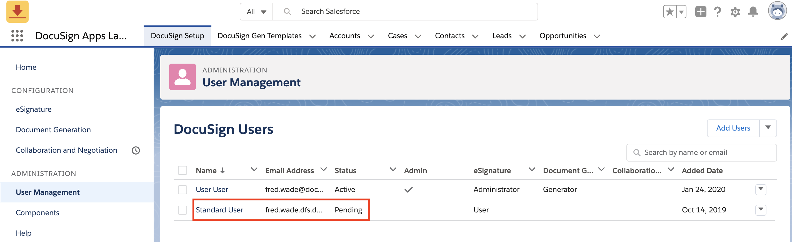

## Obtain user consent
Users of your application must grant their consent for the API to act on their behalf. There are two methods to accomplish this. If you are using Organization Admin, you can grant consent on behalf of your users following the steps outlined [here](/esign-rest-api/guides/authentication/obtaining-consent#admin-consent-for-external-applications). If this is not an option for your integration, you must obtain individual consent from each user. 

Obtaining individual consent requires your application to redirect users to DocuSign’s OAuth service. The easiest option is to add the DocuSign Envelope Status component to your page. When a user has not yet granted consent, a button will be displayed on this component. When clicked, a pop-up window is launched where the user can enter their credentials and grant consent via the DocuSign authentication service. Upon granting consent, the user is returned to the Salesforce record.

1. From a Salesforce record page, click the gear icon in the upper left and click Edit Page.
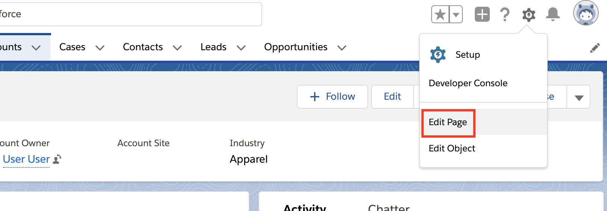

1. Drag the DocuSign Envelope Status component from the Custom list on the left to the desired location. You must have [My Domain](https://help.salesforce.com/articleView?id=domain_name_overview.htm&type=5) enabled and deployed for this component to be visible. Click Save when finished. Follow any prompts to activate the page for your users. 
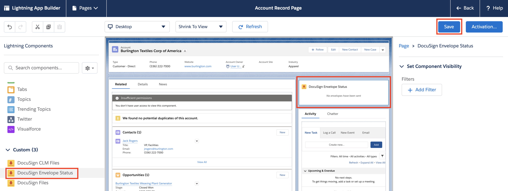

1. The component should now be visible to your users on the record page. The user clicks Authorize on the DocuSign Envelope Status component.
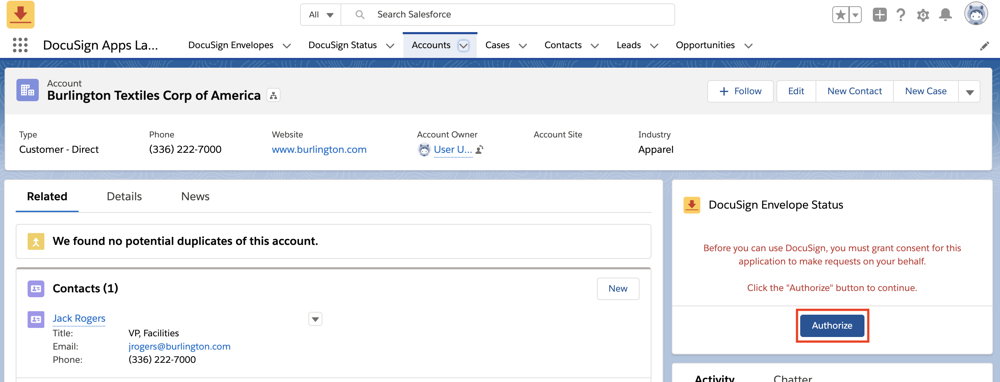

1. The user clicks Accept to grant their consent. They may have to authenticate with DocuSign first.
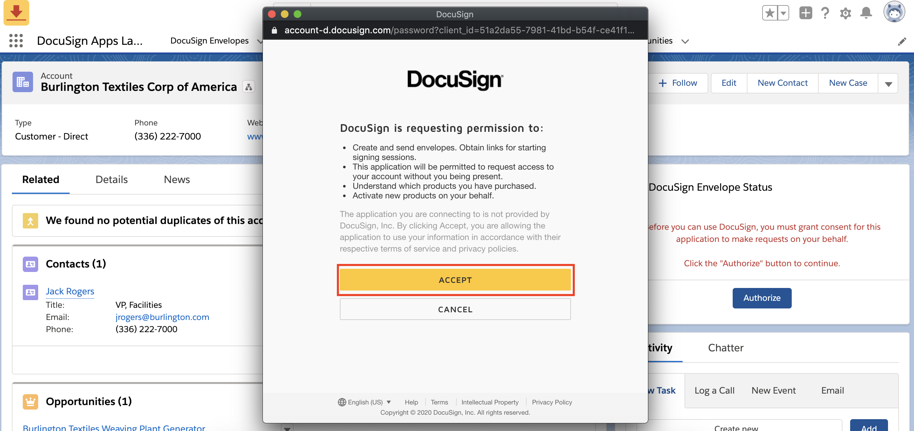

While straightforward, the DocuSign Envelope Status component option is not ideal for integrations where you need more control over the process or where the component cannot be used (e.g. Communities). As of Apex Toolkit v2.2 you can initiate the consent flow from your code and afterwards redirect the user to a page of your choosing. See [dfsle.AuthService.getLoginUrl](/salesforce/apex-toolkit-reference/authservice.html) and the [Obtaining Consent Code Example](../code_examples/obtaining_consent.md) for details.
